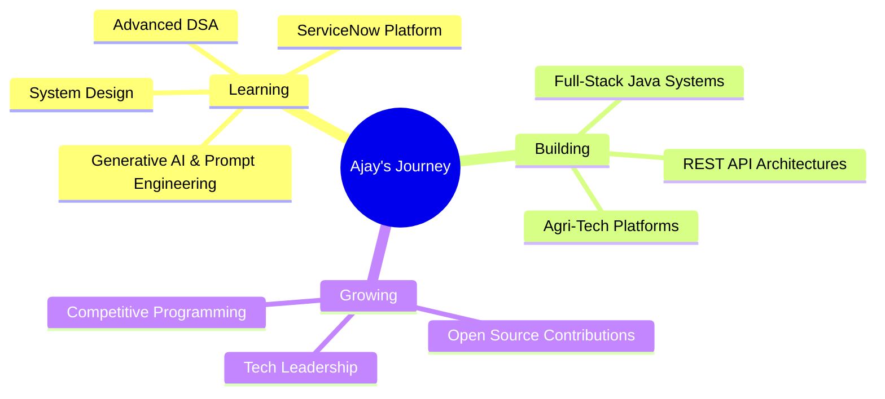

<div align="center">

<!-- Custom AI banner — upload ai-banner.png to an assets/ folder in this repo, path below already matches -->


</div>

<div align="center">

[](https://linkedin.com/in/korne-ajay)
[](mailto:korneajayk@gmail.com)
[](https://github.com/korneajay)


</div>

---

## 🎯 About Me

```java
public class Ajay {

    private final String role = "Aspiring Java Backend Engineer";
    private final String location = "Hyderabad, India 🇮🇳";

    private final String[] coreStack = {
        "Java",
        "Spring Boot",
        "SQL",
        "Hibernate",
        "REST APIs"
    };

    private final String[] currentlyLearning = {
        "Microservices",
        "System Design",
        "Generative AI",
        "Docker",
        "AWS"
    };

    private final String[] strengths = {
        "Backend Development",
        "Database Design",
        "API Development",
        "Problem Solving",
        "DSA"
    };

    public String mission() {
        return "Design scalable backend systems with clean architecture and optimized SQL.";
    }

    public void dailyRoutine() {
        while (!success) {
            code();
            optimizeSQL();
            solveDSA();
            buildProjects();
            learn();
            repeat();
        }
    }

    public String status() {
        return "Building one Spring Boot project at a time 🚀";
    }
}
```

<!-- EDIT: replace with your own real photo if you want to swap it later -->


### 🚀 What Drives Me

- 💻 **Solo System Builder** — designed and shipped 2 full-stack platforms end-to-end on my own
- 🏗️ **Backend-First Thinker** — REST APIs, OTP auth, quota systems, real-time stock tracking
- 🧩 **Algorithmic Problem Solver** — implemented Dijkstra's Algorithm from scratch for route optimization
- 👥 **Team Leader** — led and mentored a 10-member peer team across academic & workshop initiatives
- ⚡ **Fast Learner** — picked up GenAI prompt engineering, OS, and ServiceNow fundamentals this year alone
- 🎯 **Detail-Oriented** — strong grounding in DSA, OS, CN, and DBMS fundamentals

<br clear="right"/>

---

## 🏆 Achievements & Recognition

<table>
<tr>
<td width="50%">

### 👥 Leadership
- 🏆 **Project Leader** — led & mentored a 10-member peer team
- 🧩 Active competitive programmer on **HackerRank**
- 🤲 Volunteer — **Marpu Foundation**, Hyderabad

</td>
<td width="50%">

### 📜 Certifications
- ✅ Java Essentials — Infosys Springboard
- ✅ DevOps and Networking Workshop — Code For India Foundation
- ✅ GenAI: Prompt Engineering & Automation — Pantech Solutions
- ✅ Operating Systems Basics — Cisco Networking Academy
- ✅ Welcome to ServiceNow — ServiceNow

</td>
</tr>
<tr>
<td colspan="2">

### 🎓 Internship Experience
- 💼 **Software Engineering Job Simulation — JPMorgan Chase & Co. (Forage)** *(May–Jul 2024)* — Built a multi-endpoint REST API in Java & Spring Boot, integrated an H2 database layer, and wrote test cases covering core API functionality using enterprise data-handling patterns

</td>
</tr>
</table>

---

## 💼 Featured Projects

<div align="center">

| Project | Description | Tech Stack | Repo |
|---------|-------------|------------|------|
| 🌾 **Kisan Fertilize** | Fair fertilizer booking & distribution system for farmers — 3-role access (Farmer/Dealer/Admin), OTP auth, quota management | Java, Spring Boot, Hibernate, MySQL, React | [View Repo →](https://github.com/korneajay/urea_booking_system) |
| 🚜 **Farmer Machines** | Farm machinery rental platform with Dijkstra's-Algorithm-based dispatch routing for optimal inter-village distance | Java, Spring Boot, Hibernate, MySQL/H2, Docker | [View Repo →](https://github.com/korneajay/farmer-machines) |

</div>

---

## 🛠️ Tech Arsenal

<div align="center">

### Languages & Core


### Core CS Fundamentals


</div>

---

## 📊 GitHub Analytics

<div align="center">


</div>

---

## 🏆 GitHub Trophies

<div align="center">

[](https://github.com/ryo-ma/github-profile-trophy)

</div>

---

## 📈 Contribution Graph

<!-- 
  EDIT — Contribution snake (one-time setup):
  1. Add .github/workflows/snake.yml (provided separately) to this repo
  2. Run the Action once → it creates an "output" branch with the SVGs
  3. Once live, this animates automatically
-->
<div align="center">


</div>

---

## 💭 Dev Quote

<div align="center">


</div>

---

## 🎯 Current Focus



---

## 🤝 Let's Connect & Collaborate!

<div align="center">

I'm always excited to connect with fellow developers, contribute to interesting projects, or talk about backend engineering and system design!

### 📬 Reach Out

[](https://linkedin.com/in/korne-ajay)
[](https://github.com/korneajay)
[](mailto:korneajayk@gmail.com)

### 💼 Open For

- 💻 Software Engineering / Backend Developer Internships
- 🏗️ Full-Stack Development Projects (Java + Spring Boot + React)
- 📚 Learning & Knowledge Sharing
- 🚀 Open-Source Collaboration

</div>

---

<div align="center">

### 🌟 "Build it end-to-end, then make it better" ✨

**Thanks for visiting! Let's build something amazing together 🚀**


</div>

---

<div align="center">

**Made with ☕ and a lot of debugging by Korne Ajay**


*Last Updated: June 2026*

</div>
